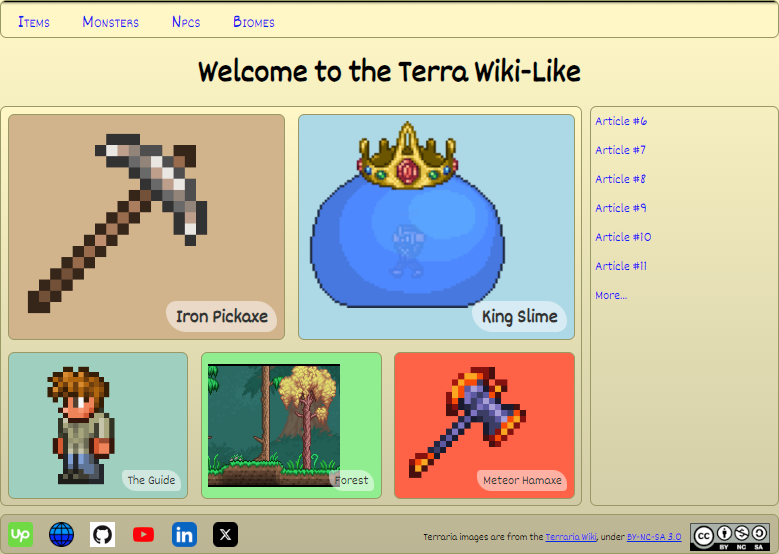

# Udacity Blog Project

This project is for Udacity's [Front-End Web Developer Nanodegree](https://www.udacity.com/course/front-end-web-developer-nanodegree--nd0011) course.



The requirements are to use your HTML and CSS skills to build a personal blog website, including custom images, layout, and styling. 

Along with webpage design considerations, you'll work to appropriately structure your files, as well as use proper CSS and HTML formatting & style. Also, it should demonstrate responsive functionality on various screen sizes.

Instead of making a traditional blog, I decided to make a "wiki-like", using the popular game, [Terraria](https://terraria.wiki.gg/wiki/Terraria_Wiki), as inspiration.

It includes five articles that briefly detail a few of the game's features.

You can view this project live here:
[https://gameplaycoder.com/projects/udacity/blog-project](https://gameplaycoder.com/projects/udacity/blog-project)

The home page includes a section of links to five articles.

## Defining the Grid Template for the Five Items on the Home Page

This section is defined using a CSS grid. Due to responsive functionality, the grid uses two different layouts. It's prominent layout is:
- column of two items in the first row
- column of three in the second row

It's defined as:
```
.content {
  display: grid;
  grid-template-areas:
    "cnt-maj1 cnt-maj1 cnt-maj1 cnt-maj2 cnt-maj2 cnt-maj2"
    "cnt-min1 cnt-min1 cnt-min2 cnt-min2 cnt-min3 cnt-min3";

  grid-template-columns: repeat(6, 1fr);
  grid-template-rows: 60% 40%;
  ... /* other properties */
}
```
(cnt-maj1 = "content major item #1", cnt-min1 = "content minor item #1", etc.)

To make the first two items larger than the other three, each item uses up half of available columns. Each of the smaller three items use one third of the columns.

The number of columns defined in each row must be the same, so there's a problem here.

In this case, it was solved by finding the least common multiple of 3 and 2, which is 6. So, each row in the template has six columns.

The larger items each use 6 / 2 (half) = 3 columns
The smaller items each use 6 / 3 (third) = 2 columns
```
        COLUMN 1 | COLUMN 2 | COLUMN 3 | COLUMN 4 | COLUMN 5 | COLUMN 6
------+----------+----------+----------+----------+----------+---------
ROW 1 |  item 1  |  item 1  |  item 1  |  item 2  |  item 2  |  item 2
------+----------+----------+----------+----------+----------+---------
ROW 2 |  item 3  |  item 3  |  item 4  |  item 4  |  item 5  |  item 5
-----------------------------------------------------------------------
```
`grid-template-areas` follows the same format:
```
grid-template-areas:
  "cnt-maj1 cnt-maj1 cnt-maj1 cnt-maj2 cnt-maj2 cnt-maj2"
  "cnt-min1 cnt-min1 cnt-min2 cnt-min2 cnt-min3 cnt-min3";
```
**An aside**: Since coding editors use a fixed-width font, where every character is the same width, I like to make the lengths of the names of all the grid areas the same. It makes it easier for me to visualize them in the code.

## Defining the Columns and Rows of the Grid Template
Since all columns in the grid use the same amount of space, and there are six columns, it can be coded as:

`grid-template-columns: 1fr 1fr 1fr 1fr 1fr 1fr;`

or

`grid-template-columns: repeat(6, 1fr);`

Defining the rows was a little easier. Since the first two items are larger, I wanted them to occupy more of the height than the other items. Defining a 60/40 split works well:
grid-template-rows: 60% 40%;

## Importing CSS files
Though it was not covered in the material, we'll need to use the CSS at-rule, `@import`, to add additional CSS files to the project. CSS files are evaluated in the order they are included.

I decided to create the additional CSS files to separate responsive-related rules. The main CSS file imports the following files in this order:

1. styles-small.css: defines small screens with width less than 550 pixels
2. styles-medium.css: defined medium screens with with at least 550 pixels and less than 900 pixels
3. styles-large.css: defined large screens with with at least 900 pixels

Each web page in the project links only the main CSS file. It then includes the other files.

There is an advantage and a disadvantage to this approach.

**Pro:**
- Only one CSS file is required to be included on all pages

**Con:**
- If you have lots of rules that only apply to specific pages, including everything on each page may be gratuitous.

**An aside:** Although not necessary, I also like to organize the rules in each CSS file in alphabetical order, starting with type selectors, then class selectors, and finally ID selectors.

## Special Effects Using Transitions and Filters
Finally, the five items on the home page (as well as the social icons in the footer) use special effects when they are hovered over.

First, let's have a look at the footer icons.

```
.footer-link-icon:hover {
  filter: brightness(150%);
  transform: scale(1.1);
}
```

This says: when an element with the class `footer-link-icon` is hovered over, it will apply these properties. It will adjust the brightness of the element by 150%, and it will also increase the size of the element by 10%.

Next, the five icons use similar styling, there are two differences:
1. There is a smooth animation ([_transition_](https://developer.mozilla.org/en-US/docs/Web/CSS/transition)) that happens from start finish.
2. The transition is being applied to two elements, the link of the item, and the image inside the link.

To apply the transition, a transition property must be added onto the declaration of the class for the link and the image:

```
.grid-item-image {
  transition: all 0.3s ease;
  ... /* other properties */
}

.grid-item-link {
  transition: all 0.3s ease;
  ... /* other properties */
}
```

This is shorthand for the `transition` property, much like `font`, `padding`, or `border`. Here, the transition property here says:
1. target all properties that can have traditions applied to them (transition-property)
2. The duration of the transition, which is a third of a second (transition-duration)
3. The easing function which determines how the values being affected in the transition should advance from start to end (transition-timing-function). Here, the speed of the transition slows as it progresses, causing it to "ease into" the final state.

That's all I wanted to cover in this article. If you've read this far, thanks! 👍🏾

Of course, please reach out if you've a question - or if you've spotted an inaccuracy. I'm sure this may get corrected moving forward!

Writing this helped to reinforce my own understanding - or at least, how it makes sense to me. Hopefully, you'll find a small piece of  inspiration ⭐

_**- C. out.**_
